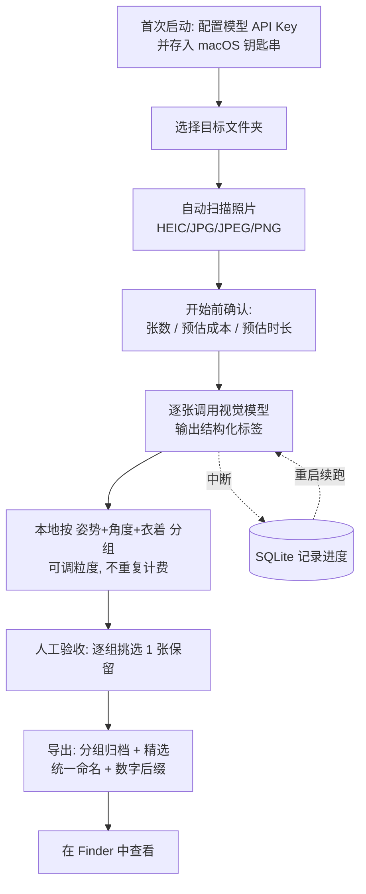
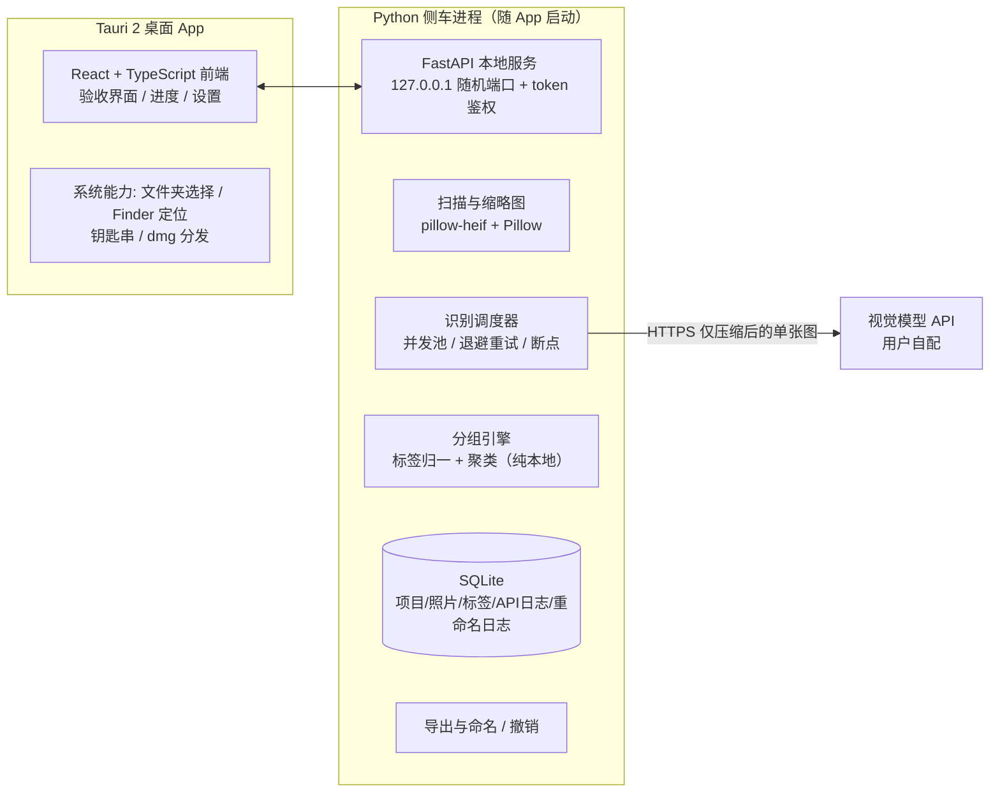

# PRD — PhotoCurator（服装照片智能分组整理 App）

| 文档信息 | 内容 |
| --- | --- |
| 产品名称 | PhotoCurator（内部代号），中文名「服装照片智能分组整理工具」 |
| 文档版本 | v1.0（草案，待评审） |
| 编写日期 | 2026-09-21 |
| 目标平台 | macOS 15.1+，本地运行 |
| 文档目的 | 作为开发执行的唯一需求依据：开发顺序、验收标准、技术方案均以本文档为准 |

---

## 1. 摘要

本文档描述一个在 macOS 上本地运行的桌面 App：用户指定一个装满拍摄照片（500–1000 张，HEIC/JPG/JPEG/PNG）的文件夹，App 调用视觉模型 API 逐张识别每张照片的**衣着、模特姿势、拍照角度**，据此把相似的照片自动分成若干组（例如 1000 张分出约 10 组、每组约百张），组内照片统一按内容命名并加数字后缀。用户随后在 App 内逐组人工挑选，每组保留一张，最终导出「分组归档 + 精选结果」。全程不改动源文件夹，可断点续跑、可撤销。

---

## 2. 干系人与联系人

| 角色 | 人 | 负责事项 |
| --- | --- | --- |
| 产品负责人 / 需求方 | 用户本人 | 需求确认、验收标准拍板、提供真实拍摄集做测试 |
| 开发负责人 | 待定（建议 1 名全栈，前端 + Python） | 架构与实现、模型选型实测 |
| UI 设计 | 待定（可复用系统组件，工作量约 1–2 周） | 验收界面、导出流程的界面稿 |
| 测试 / 验收 | 需求方 + 开发 | 金标准集标注、UAT 验收 |

---

## 3. 背景

### 3.1 问题是什么

服装电商 / 摄影团队一次拍摄动辄 500–1000 张。拍摄时同一个「姿势 + 角度」会连拍很多张，最终只需要每组挑一张用于展示。目前的做法是**人工在相册里逐张对比**：

- 1000 张照片人工对比、分组、挑选，通常要 2–4 小时，枯燥且容易看漏、看花；
- 精选结果随手命名，交给运营或客户时文件名混乱，没有规律；
- 现有工具帮不上忙：
  - 系统相册 / Google Photos 的「智能分组」按场景、时间、地点分，不懂「姿势 / 角度 / 衣着」这种服装语义；
  - 找相似 / 去重工具（PhotoSweeper 等）按像素相似判断，背景一换就失效，而且判断维度不受控；
  - 面向婚礼摄影的 AI 选片工具（Aftershoot、Narrative 等）以人脸表情为核心信号，不懂服装展示的逻辑，且按订阅收费、照片必须上传到它们的云端。

### 3.2 为什么是现在

- 轻量视觉模型（多模态 API）近两年成本降到很低、速度很快，对一张图输出「衣着 / 姿势 / 角度」的结构化描述已经可靠，1000 张的处理成本预计在个位数人民币量级（需开发前实测确认，见 7.4 假设）；
- 用户可自选模型与供应商（OpenAI 兼容协议已成事实标准），不会被单一服务商绑定。

### 3.3 为什么是「本地 App + API」形态

照片库是隐私资产，用户不接受把整个文件夹上传到某个 SaaS；但纯本地离线模型在普通 Mac 上又慢且效果不稳。因此采用：**照片和整理结果全部留在本机，仅把压缩后的单张图片发送给用户自己配置的模型 API**。

---

## 4. 目标与关键结果

### 4.1 目标

把「1000 张照片 → 分好组 → 每组选出 1 张展示图」这件事，从 2–4 小时的人工对比压缩到 **30 分钟以内**（其中人工只做最后一环：每组 20 秒左右挑一张）。同时产出统一、可读、有规律的文件命名，方便后续上传、交付。

### 4.2 关键结果（KR，均可量化验收）

| # | 关键结果 | 验收方式 |
| --- | --- | --- |
| KR1 | 1000 张照片从「选定文件夹」到「分组结果就绪」≤ 30 分钟（普通宽带、默认并发） | 性能基准测试 |
| KR2 | 分组准确率 ≥ 90%：在 200 张人工标注的金标准集上，不需要人工移动到其他组的照片占比 ≥ 90% | 自动评测脚本 |
| KR3 | 人工验收每组平均 ≤ 20 秒；10 组全部挑完 ≤ 10 分钟 | UAT 计时 |
| KR4 | 每千张识别成本 ≤ ¥10（轻量模型档），且开始处理前给出误差 ±30% 的预估 | 成本日志核对 |
| KR5 | 任意时刻中断（断网 / 关机 / 崩溃），重启后可续跑，已识别成功的照片 **0 次重复计费** | 中断注入测试 |
| KR6 | 默认导出模式完全不改动源文件夹任何文件；输出目录可一键删除恢复原状 | 文件校验（哈希对比） |

---

## 5. 目标市场与用户

按「要完成的任务」定义，而非人口属性：

| 用户群 | 要完成的任务 | 现状之痛 |
| --- | --- | --- |
| 服装电商运营 / 店铺主（主要） | 拍摄后从几百上千张里挑出主图、详情图，命名后上传 | 人工对比耗时；命名无规律 |
| 服装摄影师 / 工作室 | 交付前的选片（culling） | 逐张看片，或用不贴合服装语义的工具 |
| 穿搭博主 / 内容创作者 | 发布前从连拍里挑图 | 同上，量稍小 |

### 用户约束与使用前提

- 设备：macOS 15.1 的个人 Mac（Apple Silicon 为主，需兼容 Intel）；
- 非技术用户：App 打开即用，不装依赖、不敲命令行；唯一需要完成的「技术动作」是粘贴一次模型 API Key；
- 用户已拥有或愿意购买任一家视觉模型 API 的 Key；
- 用户接受「压缩后的图片会发送给自己选定的模型服务商」（App 内首次运行需明确提示）；
- 单次处理量级：500–1000 张（不做十万张级的设计）。

---

## 6. 价值主张

| 维度 | 现状（人工 / 现有工具） | 用 PhotoCurator |
| --- | --- | --- |
| 分组挑选耗时 | 2–4 小时逐张对比 | 分组全自动，人工只做每组 20 秒的终选，全程 ≤ 30 分钟 |
| 相似判断维度 | 不可控（像素 / 场景 / 人脸） | **只看姿势、角度、衣着**三项，判断标准与服装展示目的一致 |
| 命名 | 手工随意命名 | 按内容自动命名 + 数字后缀，规律统一，可直接交付 |
| 数据隐私 | 照片上传到 SaaS 云端 | 照片与结果全在本机，仅单张压缩图发给用户自选 API |
| 成本 | 订阅制（每月固定支出） | 按次付费，千张约几元，用多少付多少 |
| 安全性 | 整理即移动 / 删除文件 | 默认不碰源文件，可撤销 |

**一句话价值**：把「从一堆连拍里挑出每个姿势角度最好的一张」这件最耗时的活，交给按服装语义工作的 AI 预处理，人只做最后的审美决定。

---

## 7. 解决方案

### 7.1 用户流程与界面草图

#### 7.1.1 核心流程



#### 7.1.2 界面草图（低保真）

**处理中界面：**

```
┌──────────────────────────────────────────────────────┐
│ PhotoCurator                          [设置] [帮助]   │
├──────────────────────────────────────────────────────┤
│ 📁 /Users/xxx/拍摄/0921               共找到 862 张   │
│                                                      │
│ 识别中  412 / 862   ▓▓▓▓▓▓▓░░░░ 48%   预计还需 9 分钟 │
│ ┌──┐ ┌──┐ ┌──┐ ┌──┐ ┌──┐ ┌──┐                        │
│ │  │ │  │ │  │ │  │ │  │ │  │   …（实时缩略图流）     │
│ └──┘ └──┘ └──┘ └──┘ └──┘ └──┘                        │
│ 预估成本 ¥3.1 · 已用 ¥1.4 · 失败重试中 2              │
│                        [暂停] [取消（进度已保存）]     │
└──────────────────────────────────────────────────────┘
```

**分组验收界面（核心界面）：**

```
┌────────────┬─────────────────────────────────────────┐
│ 分组 (12)   │ G03 · 白色连衣裙 · 站立叉腰 · 右45°全身   │
│            │ 共 96 张 · 本组已选 1 张                  │
│ G01 132张  │ ┌────┐ ┌────┐ ┌────┐ ┌────┐ ┌────┐      │
│ G02 118张  │ │ ★  │ │    │ │    │ │    │ │    │      │
│ G03  96张 ◀│ │014 │ │022 │ │057 │ │083 │ │091 │ …   │
│ G04  88张  │ └────┘ └────┘ └────┘ └────┘ └────┘      │
│ …          │ （★ = 已选中保留；按质量分排序，可切换      │
│ 未分组  7张  │   按拍摄时间排序；点缩略图放大查看）       │
│            │ [←→]切换照片  [空格]选中  [回车]下一组     │
│            │ [AI推荐最佳]      [完成验收 → 导出]        │
└────────────┴─────────────────────────────────────────┘
```

**导出确认 → 完成：**

```
┌────────────────────────────────────┐   导出完成后：
│ 导出设置                           │   ✔ 已生成 整理结果_0921_1430/
│ 模式: (●) 复制到新文件夹 (默认)    │     ├ 00_精选/        （每组1张）
│       ( ) 硬链接（同盘不占空间）    │     ├ 01_分组归档/G03_…/
│ 输出位置: ~/Pictures/整理结果_…    │     ├ 02_未分组/
│ [取消]            [开始导出]       │     ├ manifest.csv
└────────────────────────────────────┘   [在 Finder 中显示]
```

#### 7.1.3 输出目录结构（默认复制模式）

```
整理结果_2026-09-21_1430/
├── 00_精选/                          ← 人工验收后每组保留的 1 张
├── 01_分组归档/
│   ├── G01_白色连衣裙_站立垂手_正面全身/
│   │   ├── G01_白色连衣裙_站立垂手_正面全身_001.heic
│   │   ├── G01_…_002.jpg
│   │   └── …
│   └── G02_白色连衣裙_叉腰_右45全身/
├── 02_未分组/                        ← 无法归类的少量照片
├── 03_待处理/                        ← 读取失败/损坏的文件
├── manifest.csv                      ← 新旧文件名映射 + 标签 + 是否精选
└── undo.json                         ← 撤销信息（删除输出目录即恢复原状）
```

### 7.2 功能需求清单（P0 = MVP 必须；P1 = 1.0；P2 = 后续版本）

#### A. 项目与扫描

| ID | 功能 | 优先级 | 需求描述与验收标准 |
| --- | --- | --- | --- |
| A1 | 文件夹选择 | P0 | 系统文件夹选择对话框 + 支持粘贴路径。验收：选择含子文件夹的目录时默认只扫当前层，勾选「包含子文件夹」后递归扫描。 |
| A2 | 格式支持 | P0 | 识别 `.heic/.heif/.jpg/.jpeg/.png`（扩展名大小写不敏感）。忽略视频与 Live Photo 的 `.mov` 伴生文件。验收：四类格式各 50 张混合目录全部正确入列；`.MOV/.mp4` 不入列。 |
| A3 | 扫描结果预览 | P0 | 显示总数、格式分布、分辨率分布。损坏 / 无法解码的文件单独列出，不阻塞流程。验收：注入 3 个损坏文件，App 列入「待处理」并继续。 |
| A4 | 缩略图生成 | P0 | 本地生成 ≤256px 缩略图缓存，按 EXIF 方向自动旋正。验收：iPhone 拍摄的 HEIC（含旋转信息）缩略图方向正确。 |
| A5 | RAW / 其他格式 | P2 | 支持 CR3/ARW/DNG 等 RAW 及 WebP/TIFF。 |

#### B. 模型识别

| ID | 功能 | 优先级 | 需求描述与验收标准 |
| --- | --- | --- | --- |
| B1 | API 配置 | P0 | 设置页配置：服务商预设（OpenAI 兼容 / Anthropic / 智谱 / 百炼 / 火山等，实为 base_url + 模型名）、API Key、并发数（默认 6）。Key 存入 macOS 钥匙串，不落明文配置文件。验收：Key 在文件系统中搜不到明文。 |
| B2 | 连通测试 | P0 | 「测试连接」用 1 张样图实际调用，成功显示模型名 / 延迟 / 单张 token 数；失败给出人话错误（Key 无效 / 网络不通 / 余额不足）。 |
| B3 | 结构化标签 | P0 | 每张照片一次调用，输出 7.3.4 定义的 JSON（衣着 / 姿势 / 角度 / 景别 / 质量分）。发送前图片缩至长边 1024px、JPEG 质量 85（HEIC 自动转码）。temperature=0。验收：金标准集上各枚举字段取值 100% 落在给定枚举内。 |
| B4 | 断点续跑 | P0 | 每张照片的识别状态与结果实时写入本地 SQLite。重启 App 检测到未完成项目时询问「继续」。验收：在识别到 50% 时强杀进程，重启后续跑只处理剩余 50%，成本日志无重复条目。 |
| B5 | 失败重试 | P0 | 429/超时/5xx 指数退避重试 5 次；仍失败进入「失败队列」，提供一键重试失败项。验收：模拟 429 后按退避间隔重试并最终成功。 |
| B6 | 成本预估与实际统计 | P0 | 开始前按「张数 × 单张 token 估值 × 单价」预估并需用户确认；处理中实时累计实际值。单价在设置中可填（用于核算）。 |
| B7 | 模型结果缓存 | P0 | 已识别照片的标签永久缓存（按文件内容哈希键）；同批照片调粒度重新分组、或 App 重启后，**不再调用 API、不再计费**。 |
| B8 | 枚举稳定性增强 | P1 | 对同组抽 2 张做一致性自检，枚举冲突时以多数重跑校准。 |

#### C. 分组

| ID | 功能 | 优先级 | 需求描述与验收标准 |
| --- | --- | --- | --- |
| C1 | 三轴分组键 | P0 | 组键 = 衣着签名（品类+归一主色+图案）+ 姿势（枚举）+ 角度（枚举）+ 景别（枚举）。**背景、光线、场景、表情一律不进入判断**。验收：金标准集上「同背景不同姿势」的照片被分入不同组、「同姿势不同背景」的照片在同一组。 |
| C2 | 粒度三档 | P0 | 粗 / 中（默认）/ 细三档（枚举合并规则见 7.3.5 表）。切换粒度在本地即时重算，不产生新的 API 费用。验收：1000 张真实集默认档产出 5–20 组；切档耗时 < 5 秒。 |
| C3 | 目标组数 | P0 | 可选填「期望组数 n」（如 10）：从细粒度出发自动合并最相近的组直至 ≤ n。验收：填 10 时输出组数 ≤ 10。 |
| C4 | 组名生成（规则模板） | P0 | `{组序号}_{服装描述}_{姿势}_{角度}{景别}`，如 `G03_白色连衣裙_叉腰_右45全身`。非法字符过滤、长度 ≤ 60 字符、序号补零保证 Finder 排序稳定。组按拍摄时间中位数排序（跟随拍摄顺序）。 |
| C5 | 组名润色（VLM） | P1 | 对每组代表图调用一次模型生成更自然的组名（如「白裙·叉腰站姿·侧45全身」），人工可改。每组仅 1 次调用，成本可忽略。 |
| C6 | 衣着判定一致性 | P1 | 同品类同图案但颜色名不同的两个组（如「白」vs「米白」），自动触发一次 VLM 对比两组合代表图「是否同一件衣服」，是则合并。解决 VLM 用词漂移把同一件衣服拆成两组的问题。 |
| C7 | 人工调整分组 | P1 | 拖拽照片到别的组、修改组名、删除空组。 |
| C8 | 组拆分 / 合并 | P2 | 手动把一个大组拆成两个，或合并两组。 |

#### D. 人工验收（挑选保留）

| ID | 功能 | 优先级 | 需求描述与验收标准 |
| --- | --- | --- | --- |
| D1 | 分组浏览 | P0 | 左侧组列表（封面 = 组内质量分最高照片、张数、是否已选）；右侧组内缩略图网格。缩略图点开放大查看。 |
| D2 | 单选保留 | P0 | 组内点选 / 空格键标记保留（同组互斥，换选即替换）。默认每组必须选 1 张才能完成验收，未选完的组高亮提示。 |
| D3 | 键盘流 | P0 | `←→` 切照片、`空格` 选中、`回车` 下一组。验收：不碰鼠标完成 10 组挑选。 |
| D4 | 组内排序 | P0 | 默认按质量分降序（最好的排最前）；可切换为拍摄时间序。 |
| D5 | 质量分标注 | P0 | 缩略图角标显示模型给的 1–5 质量分与问题旗标（模糊 / 闭眼 / 裁切），辅助快速决策。 |
| D6 | AI 推荐最佳 | P1 | 一键按质量分给每组预选 1 张（标记为推荐但可改），再人工过一遍即可。 |
| D7 | 大图对比 | P2 | 两张并排对比视图。 |
| D8 | 多选保留 | P2 | 允许某组保留 2+ 张（默认仍为 1）。 |

#### E. 导出与命名

| ID | 功能 | 优先级 | 需求描述与验收标准 |
| --- | --- | --- | --- |
| E1 | 复制模式导出（默认） | P0 | 生成 7.1.3 的输出目录；**源文件夹零改动**。验收：导出前后对源目录做全量哈希对比完全一致。 |
| E2 | 文件命名 | P0 | 组内文件：`{组名}_{三位序号}.{原扩展名}`，序号按拍摄时间排列，如 `G03_白色连衣裙_叉腰_右45全身_014.heic`。保留原格式不做有损转码。精选区文件沿用其带后缀文件名。 |
| E3 | manifest.csv | P0 | 列：新文件名 / 组 / 原文件名 / 原路径 / 是否精选 / 质量分 / 拍摄时间 / 标签 JSON / 该张 API 成本。 |
| E4 | 一键撤销 | P0 | 「撤销本次整理」= 删除输出目录（复制模式下即完全恢复原状）。撤销前确认。 |
| E5 | 硬链接模式 | P1 | 输出目录与源同 APFS 卷时用硬链接，零额外磁盘占用；跨卷自动降级为复制。 |
| E6 | 原位重命名模式 | P2 | 直接重命名源文件（写入详细 undo 日志，可逐条回滚）。因破坏性大，放最后并默认关闭。 |

#### F. 可靠性与平台

| ID | 功能 | 优先级 | 需求描述与验收标准 |
| --- | --- | --- | --- |
| F1 | 磁盘预检 | P0 | 导出前检查剩余空间 ≥ 预估输出体积 × 1.2（复制模式），不足则提示并建议硬链接。 |
| F2 | 打包分发 | P0 | `.dmg` 安装包，签名 + 公证（需 Apple 开发者账号）。未公证兜底：文档说明右键打开。Apple Silicon + Intel 通用二进制。 |
| F3 | 最低系统 | P0 | 最低支持 macOS 13，验证目标为 15.1。 |
| F4 | 界面语言 | P0 | 简体中文。英文 P2。 |
| F5 | 数据留存 | P0 | 项目数据、标签、缩略图存于 `~/Library/Application Support/PhotoCurator/`；提供「清除缓存」。发送给 API 的 1024px 中间图处理完即删。 |

### 7.3 技术方案

#### 7.3.1 架构



**为什么这样选（技术选型决策）：**

| 方案 | 优点 | 缺点 | 结论 |
| --- | --- | --- | --- |
| **A. Tauri 2 + React + Python 侧车（推荐）** | 体积小（含 Python 约 60–80MB）；图像生态成熟（pillow-heif 解 HEIC 最稳）；并发 / 重试 / SQLite 开发快 | 需打包 Python（PyInstaller） | **采用** |
| B. Electron + Python 侧车 | 生态最成熟，文档多 | 体积 150MB+，内存占用高 | 备选 |
| C. SwiftUI 纯原生 | 最贴合 Mac，HEIC 系统原生解码 | 团队技能门槛高；并发调度与缓存逻辑开发慢 | 备选（长期可迁移） |

#### 7.3.2 关键处理管线

1. **扫描**：遍历目录 → 扩展名过滤 → 读取 EXIF（时间 / 方向 / 分辨率）→ 计算内容哈希（去重键）→ 生成缩略图 → 入库，状态 `scanned`。
2. **识别**：并发池（默认 6）逐张取 `queued` 照片 → 解码并缩至长边 1024px JPEG（HEIC 一并转码）→ 调用模型（结构化 JSON 输出）→ 解析校验 → 标签入库，状态 `tagged`；失败按退避重试，5 次后 `failed`。每张的实际 token 数与耗时写入 `api_call_log`。
3. **分组**（纯本地，无 API）：标签归一（颜色映射到 12 个标准色名；枚举校验）→ 按当前粒度计算组键 → 聚成组 → 生成组名 → 组按拍摄时间中位数排序。粒度 / 目标组数变化时只重跑此步。
4. **验收**：前端从本地服务读取分组与缩略图，标记保留写库。
5. **导出**：按命名规范复制（或硬链接）文件 → 写 manifest.csv 与 undo.json → 在 Finder 中定位结果。

#### 7.3.3 数据模型（SQLite）

```
project(id, folder_path, created_at, settings_json, status)
photo(id, project_id, path, filename, ext, content_hash, exif_taken_at,
      width, height, size_bytes, thumb_path, status[scanned|queued|tagging|tagged|failed], error)
vision_tag(photo_id, clothing_json, pose, orientation, scale, camera_height,
           quality_score, quality_flags, raw_response, model, created_at)
photo_group(id, project_id, name, sort_key, status)
group_member(photo_id, group_id, is_keeper, manual_order)
api_call_log(id, photo_id, request_tokens, response_tokens, latency_ms,
             status, retries, created_at)
rename_log(id, photo_id, old_path, new_path, op[copy|hardlink|rename], applied_at)
```

#### 7.3.4 模型调用契约（结构化标签）

System Prompt（示例，开发时可调）：

> 你是服装电商摄影的结构化标注器。给定一张照片，只输出符合 schema 的 JSON，不输出任何其他文字。判断四件事：① 衣着：服装品类、主色、图案、袖长、显著细节；② 姿势：从枚举中选最贴近的模特姿势；③ 角度：镜头相对模特的朝向 + 景别 + 机位高低；④ 质量：1–5 分，模糊、闭眼、严重裁切要降分并在 flags 里注明。
> 注意：背景、光线、场景、道具、面部表情**不参与**衣着 / 姿势 / 角度的判断，除非它们遮挡了服装。

输出 JSON Schema（枚举即受控词表，是分组质量的根基）：

```json
{
  "has_model": true,
  "clothing": {
    "type": "连衣裙",
    "color_main": "白色",
    "pattern": "纯色",
    "sleeve": "短袖",
    "notable": "V领"
  },
  "pose": "站立-叉腰",
  "orientation": "右侧45°",
  "scale": "全身",
  "camera_height": "平视",
  "quality": { "score": 4, "flags": ["轻微模糊"] }
}
```

枚举定义：

| 字段 | 枚举值 |
| --- | --- |
| pose | 站立-双手下垂 / 站立-叉腰 / 站立-插兜 / 站立-手扶头 / 行走 / 转身回眸 / 坐-椅子 / 坐-地面 / 蹲姿 / 依靠 / 其他动作 / 无人-平铺 / 无人-挂拍 / 无人-细节 |
| orientation | 正面 / 左侧45° / 左侧90° / 背面 / 右侧45° / 右侧90° |
| scale | 全身 / 七分身 / 半身 / 面部特写 / 细节特写 |
| color_main | 白 / 黑 / 灰 / 米 / 红 / 粉 / 橙 / 黄 / 绿 / 蓝 / 紫 / 棕 / 花色（12+1 归一色名） |
| pattern | 纯色 / 条纹 / 格子 / 印花 / 碎花 / 拼色 / 其他 |

#### 7.3.5 粒度映射

| 粒度 | 组键构成 | 1000 张典型组数 |
| --- | --- | --- |
| 粗 | 衣着 + 朝向 3 档（正 / 侧 / 背） | 3–8 |
| 中（默认） | 衣着 + 姿势 + 朝向 3 档 + 景别 2 档（全身 / 非全身） | 5–20 |
| 细 | 衣着 + 姿势 + 朝向 6 档 + 景别 5 档 | 20–60 |

#### 7.3.6 性能预算

| 环节 | 目标（1000 张） |
| --- | --- |
| 扫描 + 缩略图 | ≤ 3 分钟（HEIC 解码为主要开销） |
| 模型识别 | ≥ 60 张/分钟（并发 6，单张延迟 ≤ 5 秒时）→ ≤ 17 分钟 |
| 分组计算 | < 5 秒 |
| 整体管线 | ≤ 30 分钟（KR1） |
| App 内存 | 峰值 < 1.5GB，空闲 < 300MB |
| 中间图缓存 | ≤ 300MB（1024px JPEG），处理完成即清理 |

#### 7.3.7 成本预算（公式 + 假设，开发前须实测）

单张成本 ≈ (提示词 ~500 token + 图片 ~600 token + 输出 ~1000 token) × 单价。1000 张 ≈ 110 万输入 + 100 万输出 token。**实测注**（2026-09-21，boyue 中转 glm-5.3-flash）：单张实际 ~640 输入 / ~1030 输出，输出侧比早期估计高约 7 倍（推测含思考 token），按单价核算时以实测为准。

| 模型档位 | 每千张成本（估） | 用途 |
| --- | --- | --- |
| 免费档国产视觉模型 | ¥0–5 | 可作默认（需实测稳定性） |
| 主流轻量档（GPT-4o-mini / GLM-4V / Qwen-VL 级） | ¥2–10 | **推荐默认**，满足 KR4 |
| 旗舰多模态 | ¥30+ | 仅用于组名润色、疑难抽检（P1 的 C6） |

> 以上价格随市场变动，**开发第一周必须用 3 个候选模型 × 金标准集跑基准实测**（准确性、延迟、价格三项），以实测结果定默认模型（见 8.1 M1 里程碑）。

### 7.4 假设与风险

**假设（ believes，需在 M1 验证）：**

1. 金标准集上，轻量视觉模型对姿势 / 角度 / 景别三轴的标注一致率 ≥ 90%（枚举受控 + temperature=0 + 明确忽略背景的前提下）；
2. 单次拍摄以「单模特、少量套服装」为主；多模特同框不在 v1 范围；
3. 用户接受照片经压缩后发送给其自选的模型 API；
4. 处理期间网络可用；断点续跑可覆盖偶发中断；
5. 千张量级；不需要分布式或队列系统。

**风险与对策：**

| 风险 | 概率 | 影响 | 对策 |
| --- | --- | --- | --- |
| VLM 标注不一致（同一姿势两批打出不同枚举 / 颜色用词漂移） | 中 | 分组错误 | 受控枚举 + temperature=0；C6 二次确认合并；B8 一致性自检；金标准集持续回归 |
| 实际成本高于预估 | 低 | 用户不满 | 开始前强制确认预估；实测单价；中间图压缩控制 token |
| HEIC 边角案例解码失败 | 中 | 少量照片无法处理 | 失败入「待处理」不阻塞；pillow-heif 覆盖主流 iPhone / 相机 HEIC |
| API 限流 / 网络抖动 | 高 | 处理变慢 | 退避重试 + 并发自适应降速 + 断点续跑 |
| 分组数与用户预期不符（想要 10 组给出 25 组） | 中 | 体验差 | 粒度三档 + 目标组数；重分组零费用即时生效 |
| 照片隐私顾虑 | 中 | 用户流失 | 首次运行明示数据流向；仅发压缩单图；结果全本地；P2 提供本地模型（Ollama）选项 |
| 未签名被 Gatekeeper 拦截 | 高（若不做） | 无法「直接打开」 | 1.0 必须签名 + 公证（预算 Apple 开发者账号 ¥688/年） |
| 模型服务商故障 | 低 | 不可用 | 提供商预设可切换，标签按文件哈希缓存换模型不重复计费 |

---

## 8. 发布计划

### 8.1 里程碑（相对工期，不承诺日历日期）

| 里程碑 | 内容 | 出口条件（验收） | 工期 |
| --- | --- | --- | --- |
| **M1 内部原型** | 命令行或极简界面：扫描 → 识别 → 分组 → 导出 CSV+文件夹；**完成 3 个候选模型的基准实测并定默认模型** | 金标准集 200 张跑通全管线；输出模型选型报告（准确率 / 延迟 / 成本） | 2–3 周 |
| **M2 MVP（P0 全集）** | Tauri 桌面壳、验收界面、导出与撤销、断点续跑、成本预估 | 本文档 P0 功能逐条通过验收标准；需求方用 ≥3 个真实拍摄集完成 UAT，KR1–KR6 全部达标 | +3–4 周 |
| **M3 1.0 公开版** | 签名 + 公证 dmg、P1 功能（AI 推荐 / 组名润色 / 硬链接 / 人工移组）、稳定性与异常兜底、使用文档 | 全新 Mac「下载 → 打开 → 5 分钟内完成首次整理」实测通过 | +2 周 |

单人全栈 + AI 辅助编码，到 1.0 约 **7–9 周**。

### 8.2 后续版本（Backlog，按需求热度排）

1. 本地模型选项（Ollama / 本地 Qwen-VL），完全离线模式；
2. 原位重命名 + 逐条撤销（E6）；
3. 组拆分 / 合并、大图并排对比、一组多选；
4. RAW（CR3/ARW/DNG）、WebP/TIFF；
5. 多模特同框识别、多文件夹合并项目；
6. 英文界面。

### 8.3 测试与验收（1.0 出口测试集）

| 类别 | 用例 |
| --- | --- |
| 准确性 | 200 张金标准集（3 套服装 × 多姿势角度，人工标注真值），脚本计算组纯度 / 召回，F1 ≥ 0.9 |
| 语义受控 | 「同背景不同姿势」必须异组；「同姿势不同背景」必须同组（KR 核心反例集） |
| 格式 | iPhone HEIC 50 张（含旋转 EXIF、Live Photo 伴生 mov）、PNG 透明通道、超大 100MP 图 |
| 可靠性 | 识别至 50% 强杀进程续跑；模拟 429 / 断网；损坏文件 3 个；源目录哈希前后一致（KR6） |
| 性能 | 1000 张合成集计时（KR1）；内存 / 磁盘预算达标 |
| UAT | 需求方真实拍摄集 3 次完整流程，记录每组挑选耗时（KR3） |

---

## 附：开发前需要拍板的问题（Open Questions）——已于 2026-09-21 全部拍板

| # | 问题 | 决策（已确认） |
| --- | --- | --- |
| 1 | 默认模型服务商 | **智谱 GLM 5.3 flash**（OpenAI 兼容协议，预设 base_url + 模型名，可随时切换其他兼容服务商） |
| 2 | 输出默认模式 | **原位重命名源文件**（放弃"复制到新文件夹"默认；组内文件改名为 `组名_序号.扩展名`，人工保留张加 `_精选` 后缀；undo.json 记录新旧映射，一键还原）。KR6 相应调整为：撤销后文件名 100% 恢复原状 |
| 3 | RAW 格式 | 不兼容，仅 heic/heif/jpg/jpeg/png |
| 4 | 组名规则 | 按维度组合模板：`G{序号}_{主色}{品类}_{姿势}_{朝向}{景别}_{三位序号}` |
| 5 | Apple 开发者账号 / 签名公证 | 不申请；**优先本地化安装**（本地脚本创建虚拟环境 + 安装依赖 + 启动服务，无需签名与公证） |

## 附：实现说明（MVP 已交付）

- **技术栈调整**：放弃 PRD 7.3.1 的 Tauri 2 + React + Python 侧车三栈结构，改为**单文件 Python 后端（stdlib http.server + SQLite）+ 单文件浏览器界面（原生 JS）**。覆盖全部 P0 功能，无构建步骤、依赖仅 pillow/pillow-heif。理由：单人开发下这是满足"本地打开→输入路径→自动整理→人工验收→重命名"全流程的最短路径；Tauri 原生壳只增加打包观感，属后续可选增强。
- 已实现：扫描（格式过滤/EXIF 时间/缩略图缓存/损坏文件隔离）、GLM 识别（结构化枚举 JSON/温度0/退避重试/同哈希结果复用不重复计费/断点续跑）、三档粒度分组+目标组数合并（本地重算零费用）、维度组合组名、每组单选保留（互斥）、原位重命名+`_精选` 标记、manifest 清单、一键撤销、成本按 token 统计（配置单价后显示）。
- 未实现（后续版本）：AI 推荐最佳（现以最高质量分缩略图蓝框提示代替）、组名 VLM 润色、硬链接/复制导出模式、钥匙串存 Key（现为 ~/.photocurator/ 配置文件）、macOS .app 壳。
